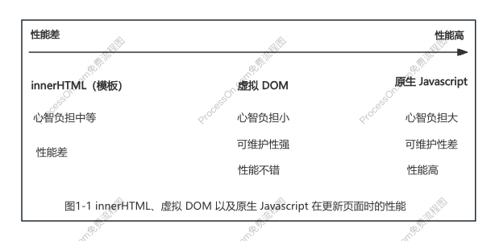

# chapter1 权衡的艺术

- [x] 1. 命令式和声明式
- [x] 2. 性能与可维护性的权衡
- [x] 3. 虚拟 DOM 的性能到底如何
- [x] 4. 运行时和编译时
- [x] 5. 总结
  
### 一、命令式和声明式

命令式框架一大特点是关注过程，例如 jQuery、Javascript。
声明式框架更加关注结果，例如 Vue，封装了过程，暴露给用户的却是更加声明式。

### 二、性能与可维护性的权衡

**声明式代码的性能不优于命令式代码的性能**。理论上命令式代码可以做到极致的性能优化，但是声明式代码不一定能做到这一点，因为它描述的是结果。

- 命令式代码的更新性能消耗 = 直接修改的性能消耗
- 声明式代码的更新性能消耗 = 找出差异的性能消耗 + 直接修改的性能消耗

最理想情况是，当找出差异的性能消耗为0时，两者性能消耗相同，但是无法做到，因为**框架本身就是封装了命令式代码才实现了面向用户的声明式**。

在采用声明式提升可维护性的同时，性能就会有一定的损失，而框架设计者要做的就是：**在保持可维护性的同时让性能损失最小化**。

### 三、虚拟 DOM 的性能到底如何

如果我们能够最小化**找出差异的性能消耗**，就可以让声明式代码的性能无限接近命令式代码的性能。而所谓的虚拟 DOM，就是为了**最小化**找出差异这一步的性能消耗而出现的。

- 通过 `innerHTML` **创建页面**的性能 = HTML 字符串拼接的计算量 + innerHTML 的 DOM 计算量
- 通过 `虚拟 DOM` **创建页面**的性能 = 创建 Javascript 对象的计算量 + 创建真实 DOM 的计算量

无论是纯 Javascript 层面的计算，还是 DOM 层面的计算，其实两者差距不大。

- 通过 `innerHTML` **更新页面**的性能 = 销毁所有旧 DOM 的计算量 + 新旧所有新 DOM 计算量
- 通过 `虚拟 DOM` **更新页面**的性能 = 创建 Javascript 对象的计算量 + Diff 的计算量 + 必要的 DOM 更新

当更新页面时，影响虚拟 DOM 的性能因素（数据变化量）与影响 innerHTML 的性能因素（模板大小）不同。

### 四、运行时和编译时

当设计一个框架的时候，我们有三种选择：纯运行时、运行时 + 编译时（Vue.js 3）、纯编译时（Svelte）。

- 纯运行时：将用户提供的**树形结构数据对象**渲染成**DOM 元素**。
- 纯编译时：将用户提供的**HTML 字符串**采用**命令式代码**渲染成**DOM 元素**。
- 运行时 + 编译时：将用户提供的**HTML 字符串**编译成**树形结构数据对象**，然后将**树形结构数据对象**渲染成**DOM 元素**。

三者优缺点分析：

- 纯运行时：没有编译的过程，没办法分析用户提供的内容。
- 纯编译时：可以分析用户提供的内容。由于不需要任何运行时，而是直接编译成可执行的 Javascript 代码，因此性能会更好，但这样做法有损灵活性，即用户提供的内容必须编译后才能用。
- 运行时 + 编译时：可以分析用户提供的内容，看看哪些内容未来可能会改变，哪些内容永远不改变，这样就可以在编译时提取这些信息，然后将其传递给 Render 函数，Render 函数得到这些信息后，就可以进一步优化。