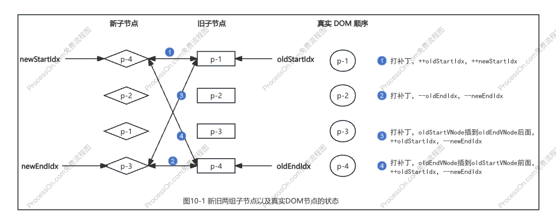
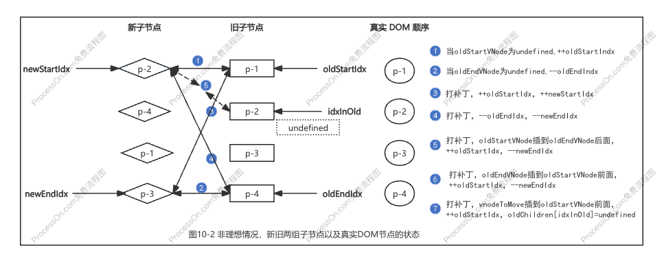

# chapter10 双端 Diff 算法

- [x] 1. 双端比较的原理
- [x] 2. 双端比较的优势
- [x] 3. 非理想状况的处理方式
- [x] 4. 添加新元素
- [x] 5. 移除不存在的元素
- [x] 6. 总结

### 一、双端比较的原理

**双端 Diff 算法**：是一种同时对新旧两组子节点的两个端点进行比较的算法。

### 二、双端比较的优势

与简单 Diff 算法相比，双端 Diff 算法减少 DOM 移动操作次数。

### 三、非理想状况的处理方式

**非理想情况**：在四个步骤的比较过程中，都无法找到可复用的节点。

**处理方式**：在非头部、非尾部的查找节点可否复用。

### 四、添加新元素

**情况一**：非理想情况下没有找到，是新增节点，挂载到 oldStartVNode 前面。

**情况二**：循环结束，`newStartIdx <= newEndIdx`，这中间的都挂载到 oldStartVNode 前面。

### 五、移除不存在的元素

循环结束，`oldStartIdx <= oldEndIdx`，这中间的都逐一卸载。

### 六、总结

