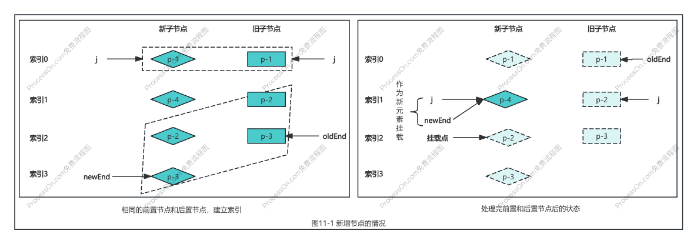
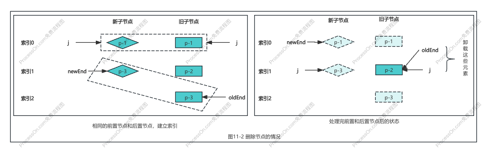
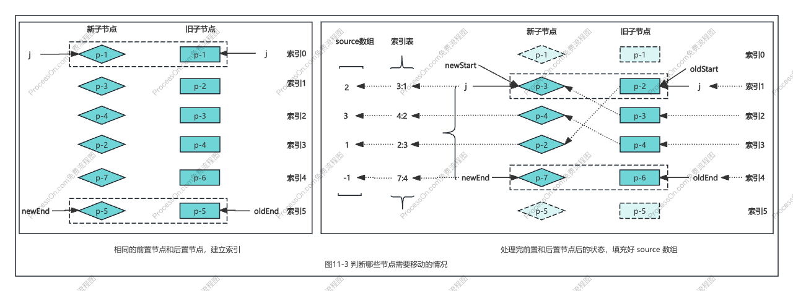
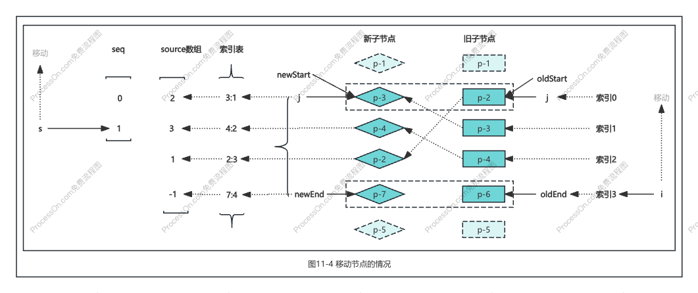
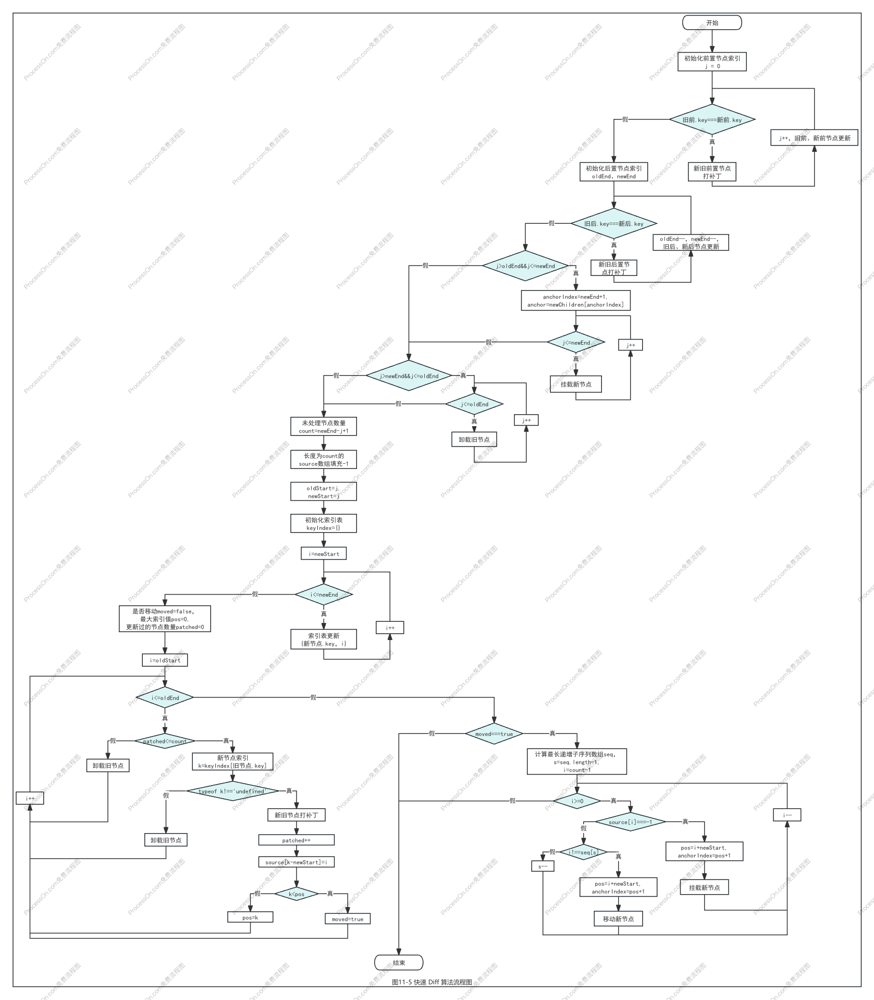

# chapter11 快速 Diff 算法

- [x] 1. 相同的前置元素和后置元素
- [x] 2. 判断是否需要进行 DOM 移动操作
- [x] 3. 如何移动元素
- [x] 4. 总结

### 一、相同的前置元素和后置元素

快速 Diff 算法思路：先处理新旧两组子节点中相同的前置节点和相同的后置节点，然后挂载新的节点，卸载旧的节点。流程如下：

### 二、判断是否需要进行 DOM 移动操作

非理想情况下，前置节点和后置节点处理完毕，新旧节点都还有有部分未处理。这时就要移动可复用节点、卸载多余节点、挂载新增节点。

注意：
+ **source 数组**：该数组长度等于新的一组子节点去掉相同的前置/后置节点后，剩余未处理节点的数量。存储新的一组子节点中的节点在旧的一组子节点中的位置。
+ **moved 标识**：判断是否需要进行 DOM 移动。

### 三、如何移动元素

注意：
+ **seq 数组**：最长递增子序列中的元素在 souce 数组中的位置索引；
+ **索引 i**：指向新的一组子节点中的最后一个节点；
+ **索引 s**：指向最长递增子序列中的最后一个元素。

### 四、总结

