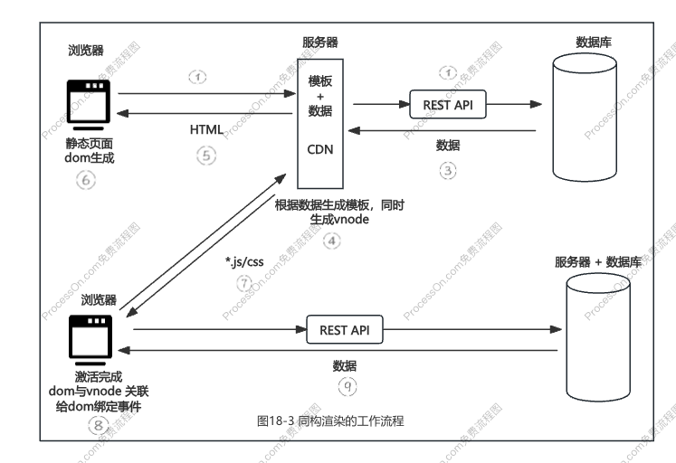

## CSR、SSR 以及同构渲染

### 一、服务端渲染（server-side rendering, SSR）

在 web2.0 之前，网站主要负责提供各种各样的内容，通常是一些新闻站点、个人博客、小说网站等。这些站点主要强调内容本身，而不强调与用户之间具有高强度的交互。当时的站点基本采用传统的服务端渲染技术来实现。例如，比较流行的 PHP/JSP 等技术。

SSR 在服务端完成模板和数据的融合。

1. 用户通过浏览器请求站点。
2. 服务器请求 API 获取数据。
3. 接口返回数据给服务器。
4. 服务器根据模板和获取的数据拼接出最终的 HTML 字符串。
5. 服务器将 HTML 字符串发送给浏览器，浏览器解析 HTML 内容并渲染。

当用户再次通过超链接进行页面跳转，会重复上述5个步骤，用户体验非常差。

### 二、客户端渲染（client-side renderin，CSR）

以 AJAX 为代表，催生了 Web2.0。在这个阶段，大量的 SPA(single-page application) 诞生。

CSR 是在浏览器中完成模板与数据的融合。

1. 客户端向服务器或 CDN 发送请求，获取静态页面（页面会包含 `<style>`、`<link>` 和 `<script>` 等标签）。此时页面处于“白屏”阶段。
2. 虽然 HTML 页面是空的，但浏览器仍然会解析 HTML 内容。由于 HTML 页面存在 `<link>` 和 `<script>` 标签，所以浏览器会加载 *.js/css 资源。接着，服务器或 CDN 会将相应的资源返回给浏览器，浏览器对 CSS 和 Javascript 代码进行解释和执行。因为页面的渲染任务是由 Javascript 来完成的，所以当 Javascript 被解析和执行后，才会渲染出页面内容，即“白屏”结束。但初始渲染出来的内容通常是一个“骨架”，因为还没有请求 API 获取数据。
3. 客户端再通过 AJAX 技术请求 API 获取数据，一旦接口返回数据，客户端就会完成动态内容的渲染，并呈现完整的页面。

当用户再次通过点击“跳转”到其他页面时，浏览器并不会真正的进行跳转动作，即不会进行刷新，而是通过前端路由的方式动态地渲染页面，这对用户的交互体验非常友好。

### 三、同构渲染

融合 SSR 与 CSR 两者的优点于一身。同构渲染氛围首次渲染（即首次访问或刷新页面）以及非首次渲染。

首次渲染是在服务端完成模板和数据的融合。

1. 当首次访问或刷新页面时，整个页面的内容是在服务端完成渲染的，浏览器最终得到的是渲染好的 HTML 页面。这个页面是纯静态的，并且与 SSR 所产生的 HTML 页面不同的是，这个页面会包含当前页面所需要的初始化数据。即服务器通过 API 请求的数据会被序列化为字符串，并拼接到静态的 HTML 字符串中，最后一并发送给浏览器。
2. 解析并渲染上面的静态 HTML 页面，在解析过程中，浏览器会发现 HTML 代码中存在 `<link>` 和 `<script>` 标签，于是会从 CDN 或服务器获取相应的资源。当 Javascript 资源加载完毕后描绘进行激活操作（即 “hydration”）。激活包含两部分工作内容。
  * Vue.js 在当前页面以及渲染的 DOM 元素以及 Vue.js 组件所渲染的虚拟 DOM 之间建立联系。
  * Vue.js 从 HTML 页面中提取出由服务端序列化后发送过来的数据，用以初始化整个 Vue.js 应用程序。
3. 激活完成后。整个应用程序以及完成被 Vue.js 接管为 CSR 应用程序了。后续操作都会按照 CSR 应用程序的流程来执行。

如果刷新页面，仍然会进行服务端渲染，然后进行激活，如此往复。

### 四、三者对比

下表对比了 SSR、CSR 和同构渲染的优劣：

| -              | SSR  |  CSR   | 同构渲染 |
| :------------- | :--: | :----: | :------: |
| SEO            | 友好 | 不友好 |   友好   |
| 白屏问题       |  无  |   有   |    无    |
| 占用服务端资源 |  多  |   少   |    中    |
| 用户体验       |  差  |   好   |    好    |

对同构渲染的最多误解是，它能够提升**可交互时间（TTI）**。事实是同构渲染仍然需要像 CSR 那样等待 JavaScript 资源加载完成，并且客户端激活完成后，才能响应用户操作。因此，理论上同构渲染无法提升可交互时间。

同构渲染的 “同构” 一词的含义是，同样一套代码既可以在服务端运行，也可以在客户端运行。