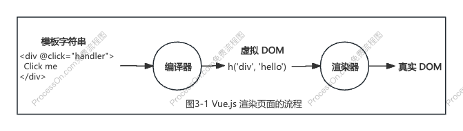

## 模板的工作原理

将模板转换成虚拟 DOM 的工作是由 Vue.js 中的另一个重要组件部分：**编译器**，来实现的。

以我们熟悉的 Vue 组件为例：

```vue
<template>
  <div @click="handler">
    Click me
  </div>
</template>

<script>
export default {
  data () {/* ... */},
  methods: {
    handler () {/* ... */}
  }
}
</script>
```

其中 `<tempalte></template>` 中的内容就是模板内容，编译器会把该内容编译成渲染函数并添加到 `<script>` 标签块的组件对象中：

```js
export default {
  data () {/* ... */},
  methods: {
    handler () {/* ... */}
  },
  render () {
    return h('div', { onClick: handler }, 'Click me')
  }
}
```

模板的工作原理（Vue.js 渲染页面的流程）：对于一个组件来说，模板（一个普通的字符串）通过**编译器**分析并生成渲染函数，然后**渲染器**再把渲染函数返回的虚拟 DOM 渲染成真实 DOM。

