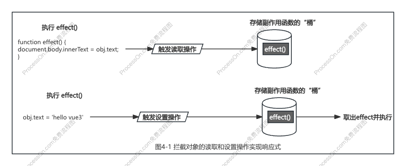
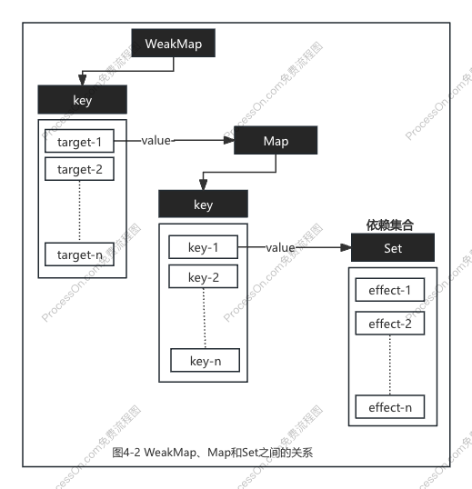
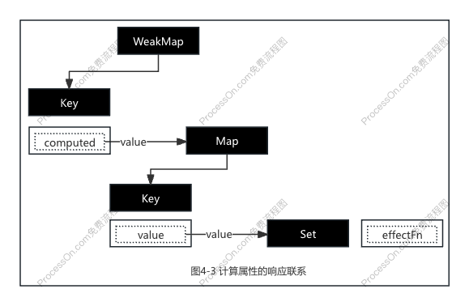

# chapter4 响应系统的作用与实现

- [x] 1. 响应式数据与副作用函数
- [x] 2. 响应式数据的基本实现
- [x] 3. 设计一个完善的响应系统
- [x] 4. 分支切换与 cleanup
- [x] 5. 嵌套的 effect 与 effect 栈
- [x] 6. 避免无限递归循环
- [x] 7. 调度执行
- [x] 8. 计算属性 computed 与 lazy
- [x] 9. watch 的实现原理
- [x] 10. 立即执行的 watch 与回调执行时机
- [x] 11. 过期的副作用
- [x] 12. 总结

### 一、响应式数据与副作用函数

1. 副作用函数：指会产生副作用的函数。一切非纯函数（同样的输入对应同样的输出）都是有副作用的函数，也就是说副作用函数内部会直接或间接地影响到外部变量或函数。

2. 响应式数据：当数据发生变化后，副作用函数自动重新执行，这个数据就是响应式数据。

### 二、响应式数据的基本实现

实现方法：拦截一个对象的读取和设置操作，当读取属性时将副作用函数添加到桶里，当设置属性值时先更新原始数据，再将副作用函数从桶里取出并重新执行。



### 三、设计一个完善的响应系统

1. 将副作用函数改成匿名函数，解决 effect 函数硬编码的问题。

2. 对 target（被操作对象）、key（被操作属性）、effectFn（副作用函数）建立属性结构关系，解决副作用函数与被操作的目标字段之间没有建立明确联系的问题。

三个角色建立如下关系：

```
target
  └-- key
      └-- effectFn
```



### 四、分支切换与 cleanup

**分支切换**：在副作用函数内部存在一个三元表达式，根据表达式值的不同会执行不同分支的代码。当表达式的值发生变化时，代码执行的分支会跟着变化。

分支切换会导致副作用函数冗余问题，致使副作用函数进行不必要的更新。

**解决方案**：采用 cleanup 方法清除上一次建立的响应联系，而当副作用函数重新执行后，会再次建立新的响应联系，新的的响应联系中不存在冗余副作用问题。

### 五、嵌套的 effect 与 effect 栈

嵌套 effect 发生的场景：父子组件。

- **问题描述**：用全局变量 activeEffect 存储副作用之间的联系，当副作用函数发生嵌套时，activeEffect 先是指向父组件的 effect1，然后被子组件的 effect2 覆盖，导致后续收集依赖时，响应式数据都与 effect2 绑定，关系发生错乱。

- **解决方案**：采用栈解决。父组件 effect1 执行时，把 effect1 存储到栈里，接着子组件 effect2 执行，把 effect2 存储到栈里，收集依赖，effect2 里面的响应式数据与 effect2 关联，将 effect2 从栈里弹出，activeEffect 这时重新指向 effect1，收集依赖，响应式数据与 effect1 关联。

### 六、避免无限递归循环

副作用函数无限递归地调用自身，会导致栈溢出。例如：副作用函数内进行自增操作。

**原因**：对响应式数据的读取和设置操作发生在同一个副作用函数内。

**解决方案**：在 trigger 动作发生时增加守卫条件： 如果 trigger 触发执行的副作用函数与当前正在执行的副作用函数相同，则不触发。

### 七、调度执行

**可调度**：当 trigger 动作触发副作用重新执行时，有能力决定副作用函数执行的时机、次数以及方式。

给 effect 函数设计一个选项参数 options，允许用户指定调度器。

在选项参数 options 上指定 scheduler 调度函数，在 trigger 函数中触发副作用函数重新执行时，就可以直接调用用户传递的调度器函数，从而把控制权交给用户。

调度器通过一个微任务队列对任务进行缓存，实现去重，从而实现连续多次修改响应式数据但只会触发一次更新。

### 八、计算属性 computed 与 lazy

1. 通过 options 中的 lazy 属性来决定是否立即执行副作用函数，并且可以手动执行副作用函数，实现懒执行的 effect。

2. 把传递给 `effect()` 函数的函数看作一个 getter，那么这个 getter 函数可以返回任何值，这样就可以拿到副作用函数的执行结果。

3. 封装成一个对象，访问对象的 value 属性可以获取拿到副作用函数的执行结果，就能够得到基础的 computed。

4. 对副作用函数的执行结果进行缓存，避免副作用函数多次不必要的计算，只有修改值的时候，通过调度器清空缓存，重新进行计算。

5. 为了实现在另一个 effect 中读取计算属性的值时，当修改属性的值，副作用函数也会重新执行，即典型的 effect 嵌套问题：当读取计算属性的值时，手动调用 track函数进行追踪；当计算属性依赖的响应式数据发生变化时，手动调用 trigger 函数触发响应。

三个角色建立如下关系：

```
target
  └-- key
      └-- effectFn
```



### 九、watch 的实现原理

所谓 watch，其本质就是观测一个响应式数据，当数据发生变化时通知并执行相应的回调函数。

watch 的实现就是利用了 effect 以及 options.scheduler 选项。

- 当 watch 函数的第一个参数是一个响应式数据时，在 watch 内部的 effect 中调用 traverse 函数进行递归的读取操作，这样就能读取一个对象上的任意属性，当某个属性发生变化时就能触发回调函数的执行了。

- 当 watch 函数的第一个参数是一个 getter 函数时，在 watch 内部的 effect 中执行 getter 函数，获取需要依赖的响应式数据，当这些数据发生变化时，回调函数执行。

利用 effect 函数的 lazy 选项，获取新值和旧值。

### 十、立即执行的 watch 与回调执行时机

watch 两个特性：立即执行的回到函数、回调函数的执行时机。

### 十一、过期的副作用

解决“竞态问题”（常在多进程或多线程中被提及）

- 问题描述：watch 监听对象变化，每次变化都发送网络请求，由于请求异步，导致最终结果可能不是最后一次修改网络请求的结果。

- 解决方案：watch 回调函数设置第三个参数 onInvalidate 回调函数，将上一次的副作用函数标记为“过期”。