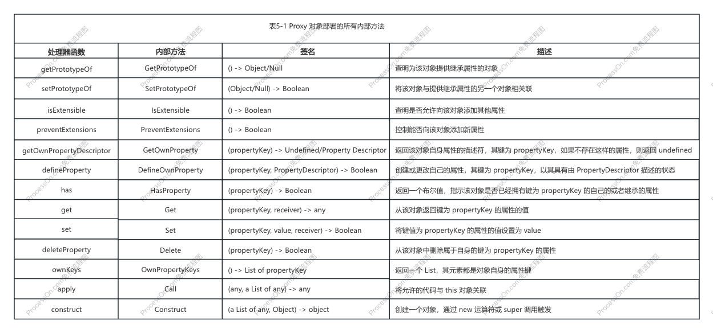

# chapter5 非原始值的响应式方案

- [x] 1. 理解 Proxy 和 Reflect
- [x] 2. JavaScript 对象与 Proxy 的工作原理
- [x] 3. 如何代理 Object
- [x] 4. 合理的触发响应
- [x] 5. 浅响应与深响应
- [x] 6. 只读和浅只读
- [x] 7. 代理数组
  - [x] 7.1 数组的索引与 length
  - [x] 7.2 遍历数组
  - [x] 7.3 数组的查找方法
  - [x] 7.4 隐式修改数组长度的原型方法
- [x] 8. 代理 Set 和 Map
  - [x] 8.1 如何代理 Set 和 Map
  - [x] 8.2 建立响应联系
  - [x] 8.3 避免污染原始数据
  - [x] 8.4 处理 forEach
  - [x] 8.5 迭代器方法
  - [x] 8.6 values 和 keys 方法
- [x] 9. 总结

### 一、理解 Proxy 和 Reflect

Vue.js 3 的响应式数据是基于 Proxy 实现的，proxy 可以为**其他对象**创建一个代理对象，只能代理对象，不能代理对象值。

**代理**指的是对一个对象基本语义的代码，它允许我们拦截并重新定义一个对象的基本操作。

`Reflect.*`方法提供了 receiver，它代表谁在读取属性，解决访问器属性的 this 执行问题。

* 问题：副作用函数内通过原始对象访问它的某个属性是不会建立响应联系的。
* 方案：代理对象的拦截函数接收第三个参数 receiver，它代表谁在读取属性。

### 二、JavaScript 对象与 Proxy 的工作原理

在 Javascript 中有两种对象：常规对象，异质对象。

在 Javascript 中，对象的实际语义是由对象的`内部方法（internal method）`指定的。所谓内部方法，指的是当我们对一个对象进行操作时，在引擎内部调用的方法，这些方法对于 Javascript 使用者来说是不可见的。

在 ECMAScript 规范中使用了 `[[xxx]]` 来代表内部方法或内部槽。

Proxy 对象的内部方法 `[[Get]]` 没有使用 ECMA 规范的 10.1.8 节给出的定义实现，所以 Proxy 是一个异质对象。

创建代理对象时指定的拦截函数，实际上是用来自定义代理对象本身内部方法和行为的，而不是用来指定被代理对象方法和行为的。



其中 `[[Call]]` 和 `[[Construct]]` 这两个内部方法只有当被代理的对象是函数和构造函数时才会部署。

### 三、如何代理 Object

下面列出了对一个普通对象的所有可能操作：

+ 访问属性：`obj.foo`；通过拦截 `get` 函数实现。
+ 判断对象或原型上是否存在给定的 key：`key in obj`；通过拦截 `has` 函数实现。
+ 使用 `for...in` 循环遍历对象：`for (const key in obj)`；通过拦截 `ownKeys` 函数实现，新增/删除属性都影响执行次数。
+ 设置属性值：`obj.foo = 'bar'`；通过拦截 `set` 函数实现。
+ 删除属性：`delete obj.foo`；通过拦截 `deleteProperty` 函数实现。
  
**注**：for...in 语句循环一个对象所有可枚举的属性，包括自身的和继承的。

### 四、合理的触发响应

1. 当值没有发生变化时，应该不需要触发响应，其中值为 NaN 时需要特殊处理（`NaN === NaN // false`）。

2. 从原型链上继承属性的情况。读取 child.bar 属性时，副作用函数不仅会被 child.bar 收集，也会被 parent.bar 收集。修改 child.bar 的值不仅会触发 child.bar 的 `set` 拦截函数，还会触发 parent.bar 的 `set` 拦截函数，致使副作用函数重新执行两次。通过 receiver 判断 target 的代理对象是否是 receiver，可以屏蔽掉 parent.bar 的 `set` 拦截函数，副作用函数就可以值执行一次。

### 五、浅响应与深响应

目前为止，我们实现的都是浅响应。所谓浅响应，指的是只有对象的第一层属性是响应的

实现深响应式的方式也很简单：当我们读取的属性值是一个普通对象时，我们再递归使用 `reactive()` 包装一层即可。

### 六、只读和浅只读

一些数据需要是只读的，当用户尝试修改或删除只读数据时，会收到一条告警信息。例如：组件接收到的 `props` 对象应该是一个只读数据。

如果一个数据是只读的，那就意味着任何方式都无法修改它。因此，没有必要为只读数据建立响应联系。

### 七、代理数组

数组是一个异质对象，因为它的 `[[DefineOwnProperty]]` 内部方法与常规对象不同，其他内部方法的逻辑与常规对象相同。

但对数组的操作与普通对象的操作仍然存在不同，下面总结了所有对数组元素或属性的**读取操作**：

+ 通过索引访问数组元素值：arr[0]；通过拦截 `get` 函数实现。
+ 访问数组的长度：arr.length；通过拦截 `get` 函数实现。
+ 把数组作为对象，使用 for...in 循环遍历；通过拦截 `ownKeys` 函数实现。
+ 使用 for...of 迭代遍历数组；
+ 数组的原型方法，如 concat/join/every/som/find/findIndx/includes 等，以及其他所有不改变原数组的原型方法。

**设置操作**：

+ 通过索引修改数组元素的值：arr[0] = 1；通过拦截 `set` 函数实现。
+ 修改数组的长度：arr.length = 0；通过拦截 `set` 函数实现。
+ 数组的栈方法：push/pop/unshift/shift；
+ 修改原数组的原型方法：splice/fill/sort 等。

除了通过数组索引修改数组元素值这种基本操作之外，数组本身还有很多会修改原数组的原型方法。调用这些方法也属于对数组的操作，有些方法的操作语义是“读取”，而有些方法的操作语义是“设置”。因此，当这些操作发生时，也应该正确地建立响应联系或触发响应。

#### 1. 数组的索引与 length

+ 如果设置的索引值大于数组当前的长度，更新了 length 属性，触发与 length 属性相关联的副作用函数重新执行。
+ 如果设置的新 length 小于 索引值时，触发响应。

#### 2. 遍历数组
   
+ 为数组添加元素、修改数组长度，本质上都是修改了数组的 length 属性，`for...in` 循环结果会改变，会触发响应。
+ `for...of` 迭代数组时，数组的长度和元素值发生变化，副作用函数会重新执行。

`Array.prototype.values` 与 `Array.prototype[Symbol.iterator]` 等价。

**注1**：如果一个对象实现了 Symbol.iterator 方法，那么这个对象是可以迭代的。
**注2**：`for...of` 是用来遍历**可迭代对象**的。
**注3**：无论使用 `for...of` 循环，还是调用 values 等方法，都会读取数组的 `Symbol.iterator` 属性，该属性是一个 symbol 值，不应该在副作用函数与这类 symbol 值直接建立响应联系，因此需要在 `get` 拦截函数进行屏蔽。

#### 3. 数组的查找方法

+ `includes` 方法为了找到给定的值，它内部会访问数组的 length 属性以及数组的索引。
+ `includes`、`indexOf` 和 `lastIndexOf` 这三个根据给定的值返回查找结果的方法，通过**原始对象**作为参数在**代理对象**中找查找，都需要重写：先在代理对象 `this` 中查找，找不到再到原始数组 `this.raw` 中查找。
  
#### 4. 隐式修改数组长度的原型方法

数组的栈方法，会隐式修改数组长度，例如 push/pop/unshift/shift。除此之外，splice 方法也会隐式地修改数组长度。

+ 问题：上面这些方法既会读取数组的 length 属性值，也会设置数组的 length 属性值，可能会导致两个独立的副作用函数互相影响，最终栈溢出。
+ 解决：这些方法间接读取 length 属性值时，通过变量 shouldTrack 屏蔽让 length 属性与副作用函数直接不建立响应联系，即可解决问题。

### 八、代理 Set 和 Map

下面总结了 Set 和 Map 这两个数据类型的原型属性和方法。

Set 类型的原型属性和方法如下：

+ size: 返回集合中元素的数量；
+ add(value)：向集合中添加给定的值；
+ clear()：清空集合；
+ delete(value)：删除指定的值；
+ has(value)：判断指定的值是否在集合中；
+ keys()：返回一个迭代器对象。迭代器对象产生的值为集合中的元素值；
+ values()：对于 Set 来说，keys() 与 values() 等价；
+ entries()：返回一个迭代器对象。迭代器对象产生的值为：[value, value]；
+ forEach(callback[, thisArg])：遍历集合中的所有元素，并对每一个元素都调用 callback 函数；第二个参数可为选择参数 thisArg，用于指定 callback 执行期上下文 this。

Map 类型的原型属性和方法如下：

+ size: 返回 Map 数据中的键值对的数量；
+ clear()：清空 Map；
+ delete(key)：删除指定 key 的键值对；
+ has(key)：判断 Map 中是否存在指定 key 的键值对；
+ get(key)：读取指定 key 对应的值；
+ set(key, value)：为 Map 设置新的键值对；
+ keys()：返回一个迭代器对象。迭代器对象产生的值为对应的 key 值；
+ values()：返回一个迭代器对象。迭代器对象产生的值为对应的 value 值；
+ entries()：返回一个迭代器对象。迭代器对象产生的值为对应的 [key, value]；
+ forEach(callback[, thisArg])：遍历 Map 数据的所有键值对，并对每一个键值对调用 callback 函数；；第二个参数可为选择参数 thisArg，用于指定 callback 执行期上下文 this。

通过上述列表可以发现，Map 和 Set 这两个数据类型的操作方法很相似。它们之前最大的不同体现在，Set 类型使用 add(value) 方法添加元素，而 Map 类型使用 set(key, value) 方法设置键值对，并且 Map 类型可以使用 get(key) 方法读取相应的值。

#### 1. 如何代理 Set 和 Map

+ 读取 size 属性时，对 `get` 拦截函数进行处理，Reflect.get 时将**代理对象** receiver 改成**原始对象**，这样访问的就是**原始对象**（Map/Set）的 size 方法。
+ 调用 delete 方法时，无论怎么修改 receiver，方法执行时 this 都会指向**代理对象**而不会指向**原始对象**，通过 bind 方法对**原始对象**进行绑定解决这个问题。

#### 2. 建立响应联系

Set 类型数据的响应方案：在副作用函数内访问 size 属性，调用**代理对象**的 add/delete 方法向集合添加/删除数据，由于这个行为间接改变集合的 size 属性值，副作用函数会重新执行。

实际操作：
+ 在副作用函数内访问 size 属性时，`get` 拦截函数需要调用 track 函数在 `ITERATE_KEY` 建立响应联系，因为任何新增、删除操作都会影响 size 属性。
+ 自定义 add 函数时，调用**原始对象**的 add 方法进行数据新增，注意添加已存在的数据时不触发响应。
+ 自定义 delete 函数时，调用**元素对象**的 delete 方法进行数据删除，注意要删除已存在的数据才出发响应。

#### 3. 避免污染原始数据

把响应式数据设置到原始数据上的行为称为数据污染。

以 Map 的 get 和 set 为例：
当调用 get 方法读取数据时，需要调用 track 函数追踪依赖建立响应联系；
当调用 set 方法设置数据时，需要调用 trigger 方法触发响应；注意1，需要判断设置的 key 是否存在，以便区分操作类型是 ADD 还是 SET；注意2，判断 value 是否是响应式数据，如果是需要通过 raw 属性获取原始数据，再把原始数据 value 设置到原始数据 target 上，这样可以避免数据污染。

#### 4. 处理 forEach

以 Map 为例，forEach 方法接收两个参数：
+ 第一个参数 callback 回调函数，callback 分别接收三个参数：值、键、原始 Map 对象，callback 参数需要重新包装成响应式；
+ 第二个参数用来指定 callback 函数执行时的 this 值，在重新包装 callback 参数为响应式的时候需要进行绑定；

`forEach` 与 `for...in` 循环遍历对象对比：
+ 两者遍历操作只与键值对的数量有关，add、delete 方法会修改键值对的数量，会触发响应，副作用函数与 `ITERATE_KEY` 建立响应联系。
+ 比起 `for...in` 只关心对象的键，`forEach` 还关心键的值，所以 set 操作时也应该触发响应，副作用函数与 `ITERATE_KEY` 建立响应联系。

#### 5. 迭代器方法

集合类型有三个迭代器方法：：
+ entries
+ keys
+ values

响应式迭代器遍历实现流程：
+ 当 `for...of` 循环迭代一个代理对象时，内部会试图从代理对象 p 上读取 `p[Symbol.iterator]` 属性，这个操作会触发 `get` 拦截函数；
+ `get` 拦截函数的 key 是 `[Symbol.iterator]` 需要重新自定义，需要获取原始数据的迭代器方法；
+ 因为需要让迭代产生的值可以被代理，所以需要根据原始迭代器方法重新自定义迭代器，对 key 和 value 进行响应式包装，最后返回一个代理对象，对象包含 `next` 方法实现；
+ `for...of` 的迭代操作与集合中元素的数量有关，只要集合的 size 发生变化，就应该触发迭代操作重新执行，因此在调用 track 函数时让 `ITERATE_KEY` 副作用函数建立响应联系。
+ `Map.prototype.entries` 与 `Map.prototype[Symbol.iterator]` 等价，两者自定义的方法可以采用同样的代码，但是 `entries` 返回的对象不能只实现 `next` 方法，还需要实现 `Symbol.iterator` 方法才是一个迭代对象。

**迭代器协议**与**可迭代协议**区别（**注**：一个对象可以同时实现可迭代协议和迭代器协议）：
+ 迭代器协议：一个对象实现了 `next` 方法。
+ 可迭代协议：一个对象实现了 `Symbol.iterator` 方法。

```js
// 可迭代对象
const obj = {
  // 迭代器协议
  next () {
    // ...
  },
  // 可迭代协议
  [Symbol.iterator] () {
    return this
  }
}
```

#### 6. values 和 keys 方法

实现响应式 values、keys 方法与 entries 相似，不同点在于：
entries：迭代器方法 `itr = target[Symbol.iterator]()` ；修改值触发副作用执行，调用 track 函数时让 `ITERATE_KEY` 副作用函数建立响应联系。
keys：迭代器方法 `itr = target.keys()`；修改值不触发副作用执行，只有新增、删除时才触发，调用 track 函数时让 `MAP_KEY_ITERATE_KEY` 副作用函数建立响应联系。
values：迭代器方法 `itr = target.values()` ；修改值触发副作用执行，调用 track 函数时让 `ITERATE_KEY` 副作用函数建立响应联系。