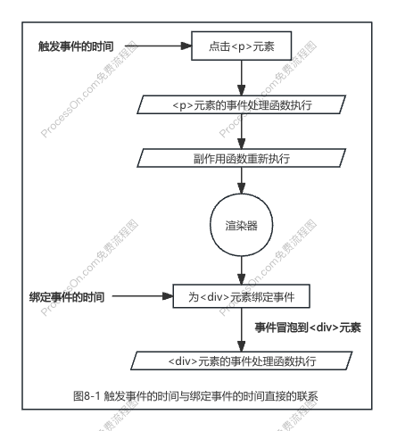
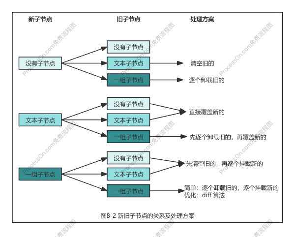

# chapter8 挂载与更新

- [x] 1. 挂载子节点和元素的属性
- [x] 2. HTML Attributes 与 DOM Properties
- [x] 3. 正确地设置元素属性
- [x] 4. class 的处理
- [x] 5. 卸载操作
- [x] 6. 区分 vnode 的类型
- [x] 7. 事件的处理
- [x] 8. 事件冒泡与更新时机问题
- [x] 9. 更新子节点
- [x] 10. 文本节点和注释节点
- [x] 11. Fragment
- [x] 12. 总结

### 一、挂载子节点和元素的属性

如果挂载子节点：递归地调用 patch 函数完成挂载即可。

如何挂载元素的属性：vnode.props 对象存储虚拟 DOM 的相关属性，通过遍历 props 对象的方式，把这些属性渲染到对应的元素上。

### 二、HTML Attributes 与 DOM Properties

**HTML Attributes**： 指的是定义在 HTML 标签上的属性，例如 `id=""`、`class=""`、`value=""`；
**DOM Properties**：DOM 元素对象会包含的属性，例如 `el.id`、`el.className`、`el.value`；

1. 很多 HTML Attributes 在 DOM 对象上有与之同名的 DOM Properties，例如 `id=""` 对应 `el.id`;
2. 但 HTML Attributes 与 DOM Properties 的名字并不总是一样的，例如 `class=""` 对应 `el.className`;
3. 并不是所有的 HTML Attributes 都有与之对应的 DOM Properties，例如 `aria-*` 类的 HTML Attributes 就没有与之对应的 DOM Properties；
4. 也不是所有的 DOM Properties 都有与之对应的 HTML Attributes，例如可以用 `el.textContent` 来设置元素的文本内容，但并没有与之对应的 HTML Attributes 来完成同样工作；
5. 一个 HTML Attributes 可能关联多个 DOM Properties。例如，`value=""` 就关联着 `el.value` 和 `el.defaultValue`；

**核心原则**：HTML Attributes 的作用是设置与之对应的 DOM Properties 的初始值。

### 三、正确地设置元素属性

使用 **setAttribute** 函数设置的值总是会被字符串化，例如 `el.setAttribute('disabled', false)` 等价于 `el.setAttribute('disabled', 'false')`，此时需要优先设置 DOM Properties：`el.disabled = false` 解决。

当 DOM Properties 的值为空时，如果值的类型是 Boolean 类型，浏览器会将它矫正为 Boolean 类型的值，即 false，例如 `props.disabled = ''` 等价于 `props.disabled = false`，此时需要手动矫正，即 `props.disabled = true`。

有一些 DOM Properties 是只读的，例如 `<input form="xxx" />`，`el.form` 是只读的，因此我们只能够通过 `setAttribute('form', xxx)` 函数来设置它。

**注**：用 in 操作符可以判断 el 是否存在对应的 DOM Properties key，例如 key in el。 

### 四、class 的处理

为什么需要对 class 属性进行特殊处理呢，这是因为 Vue.js 对 class 属性做了增强。在 Vue.js 中为元素设置类名有以下几种方式：

1. 指定为字符串值：`<p class="foo bar"></p>`；
2. 指定为一个对象：`<p :class="{ foo: true, bar: false }"></p>`；
3. 包含上述两种类型的数组：`<p :class="['foo bar', { baz: true }]">`。

在把这些值设置给 DOM 元素之前，要对值进行正常化，即 `normalizeClass(value)`。

在浏览器中为一个元素设置 class 有三种方式，按性能排序，`el.className` 最优：

1. `el.className`；
2. `el.setAttribute()`；
3. `el.classList`。

### 五、卸载操作

通过 `el.innerHTML = ''` 来清空容器，但这么做是不严谨的，原因有三点：
1. 容器的内容可能是由某个或多个组件渲染的，当卸载操作发时，应该正确地调用这些组件的 `beforeUnmount()`、`unmounted()` 等生命周期函数；
2. 即使内容不是由组件渲染的，有的元素存在自定义指令，我们应该在卸载操作发生时正确执行对应的指令钩子函数；
3. 使用 `innerHTML` 清空容器元素内容不会移除绑定在 DOM 元素上的事件处理函数。

正确的卸载方式是：
1. 创建真实 DOM 元素时，把真实 DOM 元素赋值给 vnode.el 属性，这样 vnode 与真实 DOM 之间就建立了联系；
2. 卸载时通过 vnode.el 获取该虚拟节点对应的真实 DOM 元素，然后调用原生 DOM API 完成 DOM 元素的卸载，即将其从父元素中移除。

### 六、区分 vnode 的类型

1. 渲染器在执行更新时，应先检查新旧 vnode 所描述的内容是否相同。
2. 只有内容相同时，才能打补丁；
3. 如果内容不同，则直接调用 unmount 函数将旧 vnode 卸载，例如 `vnode.type` 属性的值不同；
4. 卸载完成后，重置旧 vnode 为 null，继续进行后续的挂载操作。

### 七、事件的处理

1. 如何在虚拟节点中描述事件？
事件可以视作为一种特殊的属性，因此我们可以约定，在 `vnode.props` 对象中，凡是以字符串 **on** 开头的属性都视作事件。

2. 如何将事件添加到 DOM 元素上？
只需要在 `patchProps()` 调用 `addEventListener()` 函数绑定事件即可。

3. 更新事件如何处理呢？
方案一：先移除之前添加的事件处理函数，再将新的事件处理函数绑定到 DOM 元素上。
方案二（更优）：元素绑定伪造的事件处理函数 invoker，然后把真正的事件处理函数设置为 `invoker.value` 属性的值，这样更新事件的时候，只需要更新 `invoker.value` 的值，不需要调用 `removeEventListener` 函数。这个方案要考虑两个问题：一个元素不仅可以绑定多种类型的事件，对于同一类型的事件而言，还可以绑定多个事件处理函数。

### 八、事件冒泡与更新时机问题（先看下一章节：《更新子节点》，再看这章节）

本节讨论事件冒泡与更新时机相结合所导致的问题。例如：

```js
const { effect, ref } = VueReactivity

const bol = ref(false)

effect(() => {
  const vnode = {
    type: 'div',
    props: bol.value ? {
      onClick: () => {
        alert('父元素 clicked')
      }
    } : {},
    children: [
      {
        type: 'p',
        props: {
          onClick: () => {
            bol.value = true
          }
        },
        children: 'text'
      }
    ]
  }
  // 渲染 vnode
  renderer.render(vnode, document.querySelector('#app'))
})
```

当首次渲染完成后，用鼠标点击 p 元素，按理想情况，应该不会触发 div 元素的 click 事件处理函数执行，但是实际触发了。



根据图8-1，之所以出现上诉奇怪现象，是因为更新操作发生在事件冒泡之前，即**为 div 元素绑定事件处理事件发生在事件冒泡之前**。

为了避免上诉问题：**屏蔽所有绑定时间晚于事件触发时间的事件处理函数的执行**。

### 九、更新子节点

对虚拟节点中的 children 属性进行了规范化，规定 `vnode.children` 属性只能有如下三种类型：
* 字符串类型：代表元素具有文本子节点。
* 数组类型：代表元素具有一组子节点。
* null：代表元素没有子节点。

再更新子节点时，新旧 vnode 的子节点都有可能是以上三种情况之一，所以在执行更新时一共要考虑九种可能，即图8-2所示。



### 十、文本节点和注释节点

利用 symbol 类型值的唯一性，为文本节点和注释节点创建唯一标识，并将其作为 vnode.type 属性的值。
s
### 十一、Fragment

片段（Fragment）没有所谓的标签名称，因此需要为片段创建唯一标识，即 Fragment。

Fragment（片段）：是一个 vnode，用来描述多个根节点模板。

当渲染器渲染 Fragment 类型的虚拟节点时，由于 Fragment 本身并不会渲染任何内容，所以只需要处理 Fragment 的子节点即可。

unmount()` 函数也需要支持 Fragment 类型的虚拟节点的卸载，卸载时，只需要卸载其 children 即可。