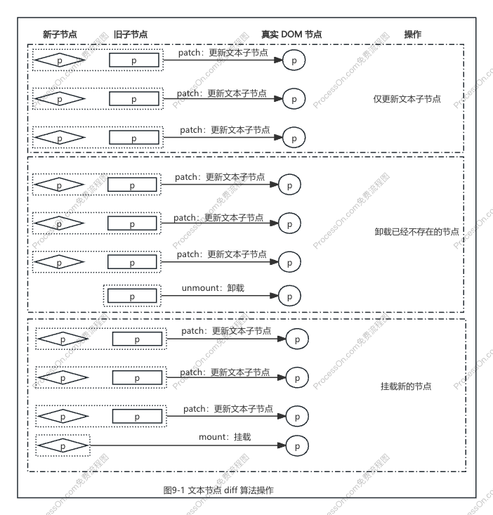
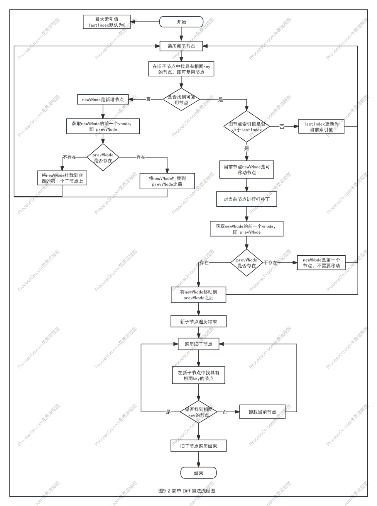

# chapter9 简单 Diff 算法

- [x] 1. 减少 DOM 操作的性能
- [x] 2. DOM 复用与 key 的作用
- [x] 3. 找到需要移动的元素
- [x] 4. 如何移动元素
- [x] 5. 添加新元素
- [x] 6. 移除不存在的元素
- [x] 7. 总结

### 一、减少 DOM 操作的性能

Diff 只关心新旧虚拟节点都是一组子节点的情况。

在上一章中，采用了简单粗暴的手段，即卸载全部旧的子节点，再挂载全部新的节点。这么做确实可以完成更新，但**由于没有复用任何 DOM 元素，所以会产生极大的性能开销**。

**改进方案**：减少 DOM 操作的次数，提升性能。

**具体操作如下**：遍历新旧两组子节点中数量较少的一组，并逐个调用 patch 函数进行打补丁，然后比较新旧两组子节点的数量，如果新的一组子节点数量更多，说明有新子节点需要挂载；否则说明在旧的一组子节点中，有节点需要卸载。

### 二、DOM 复用与 key 的作用

在上一个方案的基础上，进一步优化：**找到可复用的节点，通过 DOM 移动来完成更新操作，避免过多地对 DOM 元素进行销毁和重建**。

**如何确定节点是可复用节点？**
引入额外的 **key** 属性来作为 vnode 的标识，如果新旧两个虚拟节点的 type 属性值和 key 属性值都相同，则这个节点就是可复用节点。

**可复用节点是直接进行 DOM 移动吗？**
在移动可复用节点前，需要对节点进行打补丁操作，因为新节点的属性或 children 可能发生变化，需要更新，更新完成后才能移动。

**可复用节点如何更新？**
双层 for 循环，外层循环新的一组子节点，内层循环旧的一组子节点。逐个比对新旧子节点的 key 值，找到可复用节点，然后进行打补丁。

### 三、找到需要移动的元素

**如何判断一个节点是否需要移动？**
当新旧两组子节点的节点顺序不变时（即位置索引不变），就不需要进行移动；否则，可复用节点需要移动。

**如何找到需要移动的节点？**
拿新的一组子节点中的节点去旧的一组子节点中寻找可复用的节点。如果找到了，则记录该节点的位置索引，把这个位置索引称为最大索引。在整个更新过程中，如果一个节点的索引值比当前遇到的最大索引值还要小，则说明该节点对应的真实 DOM 元素需要移动。

**注1**：位置索引是可复用节点在旧的一组子节点中的位置索引。
**注2**：按照先后顺序记录在寻找节点过程中所遇到的位置索引，将会得到一个序列。如果这个序列时递增的，则不需要移动；否则，需要移动。

### 四、如何移动元素

移动节点：移动一个虚拟节点所对应的真实 DOM 节点，并不是移动虚拟节点本身。

**如何获取真实 DOM 节点的引用？**
通过虚拟节点的 `vnode.el` 属性获取。当一个虚拟节点被挂载后，其对应的真实 DOM 节点会存储在它的 `vnode.el` 属性中，通过旧子节点的 `vnode.el` 属性去的它对应的真实 DOM 节点。

### 五、添加新元素

对新增节点，在更新时应该正确地将其挂载。

**如何找到新增节点？**
新的一组子节点中的节点在旧子节点中找不到可复用的节点，说明当前节点为新增节点。

**如何将新增节点挂载到正确位置？**
找到锚点即可挂载到正确位置上。找到 newVNode 的前一个虚拟节点 prevVNode。如果存在，则使用它对应的真实 DOM 的下一个兄弟节点作为锚点元素；如果不存在，则说明即将挂载的 newVNode 节点是容器元素的第一个子节点，此时容器元素的 `container.firstChild` 作为锚点元素。

### 六、移除不存在的元素

当基本的更新结束时，需要遍历旧的一组子节点，然后去新的一组子节点中寻找具有相同 key 值的节点。如果找不到，则说明应该删除该节点。

### 七、总结

